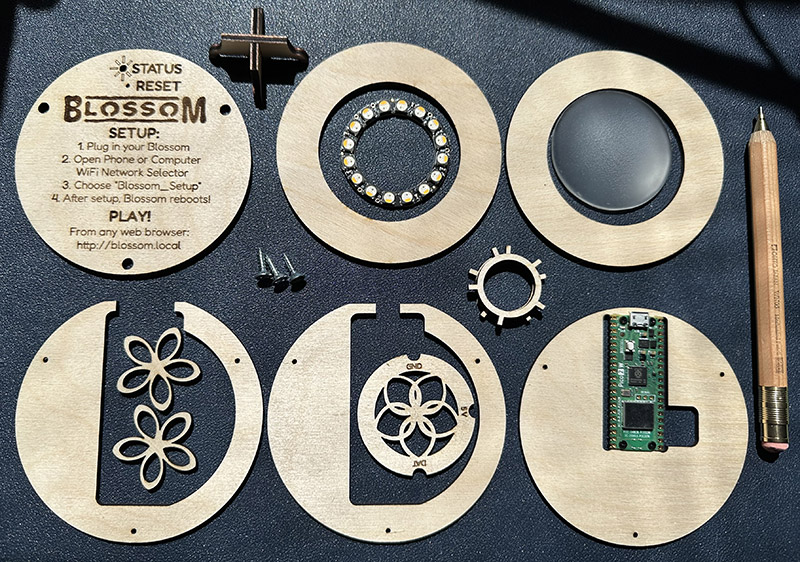
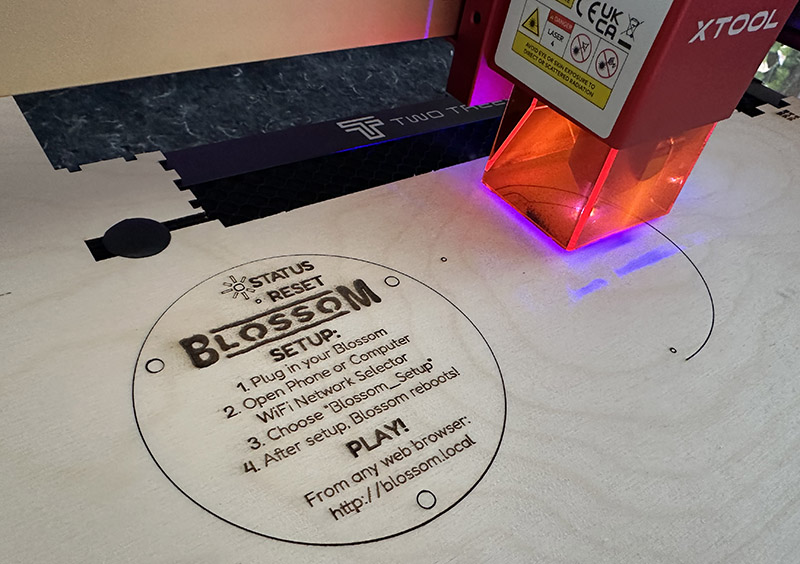
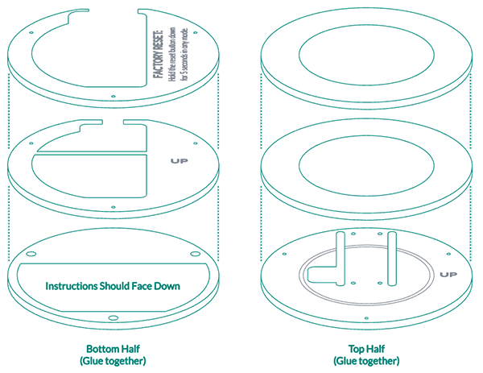
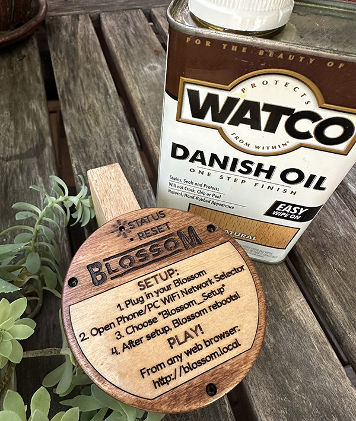
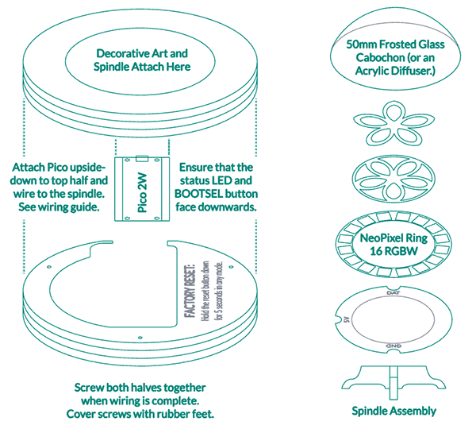
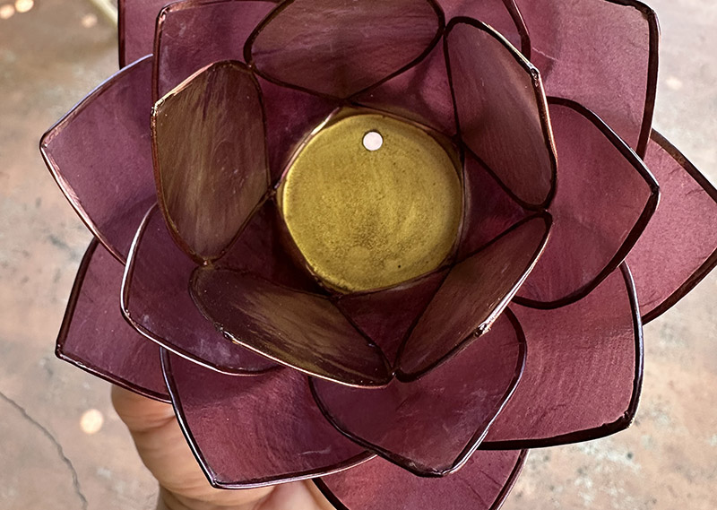
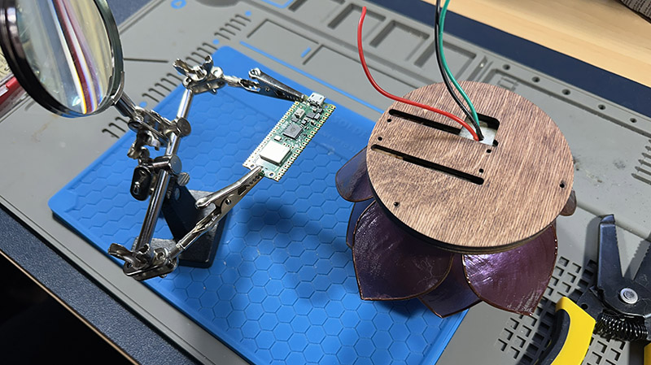
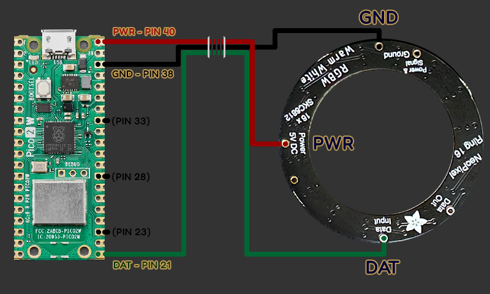
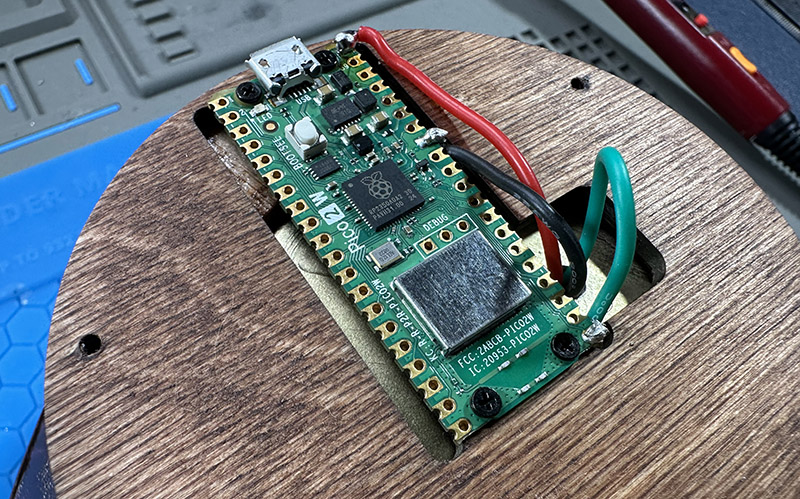
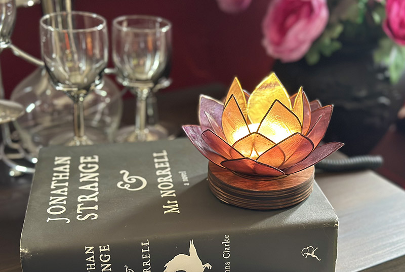

# Pysical Assembly Guide: Blossom Programmable Light Display

Building your own Blossom from scratch? Great idea! This is the perfect starter/intermediate electronics and woodworking project. All of the files you need are in this repository, and all of the hardware and skills you'll need are listed below.

---

## Table of Contents

1. [Bill of Materials](#1-bill-of-materials)
2. [Workbench Equipment](#2-workbench-equipment)
3. [Manufacturing the Case](#3-manufacturing-the-case)
4. [Prepping the Lights and Spindle](#4-prepping-the-lights-and-spindle)
5. [Prepping Your Artwork](#5-prepping-your-artwork)
6. [Wiring the Pico 2W](#6-wiring-the-pico-2w)
7. [Final Assembly](#7-final-seembly)
8. [Next Steps](#8-next-steps)

---

## 1. Bill of Materials

| Item | Qty | Est. Price (USD) | Vendor Ideas | Notes |
| :--- | :---: | ---: | :--- | :--- |
| **Raspberry Pi Pico 2W** | 1 | $7.00 | [Adafruit](https://www.adafruit.com/product/6087) [Microcenter](https://www.microcenter.com/product/687384/raspberry-pi-pico-2-w) | Our heroic Microcontroller! Make sure to get the "2W." |
| **Adafruit NeoPixel Ring (16-pixel) RGBW** | 1 | $11.95 | [Adafruit](https://www.adafruit.com/product/2854) | Beautiful pre-assembled circular array of RGBW LEDs. I prefer warm-white. |
| **Capiz-Shell Decorative Lotus Art** | 1 | ~$10.00+ | (See notes) | Any decorative tea-light holder will work; See notes below for sourcing the beautiful capiz-shell assembly shown.  |
| **50mm Frosted-Glass Cabochon** | 1 | ~$1.50+ | [Amazon](https://www.amazon.com/dp/B07JKZP1Z6) | This acts as a diffuser to bounce our LED lights around; a 50mm translucent acyrlic circle is an inexpensive alternative. |
| **3mm (1/8-in) Basswood or Birch Plywood** | 1 | ~$4.00 | Local Lumber / Craft Store | You'll need roughly 8"x12" of wood for laser cutting the case. |
| **Micro-USB Cable (3ft to 6ft)** | 1 | ~$3.00 | Generic / Amazon [Example](https://www.amazon.com/Charging-Transfer-Android-Trustable-MYFON/dp/B098DW7485/) | For power and programming. Ensure it's a data cable, not just power! |
| **5V 1A USB Power Adapter** | 1 | ~$8.00 | Generic / Amazon [Example](https://www.amazon.com/Certified-Charger-Universal-Portable-Adapter/dp/B017TXGM4I/) | Standard phone charger wall brick to power the Blossom independant of a computer. |
| **M2 Screws (6mm)** | 4 | $.40 | [Amazon](https://www.amazon.com/HVAZI-Metric-Notebook-Computer-Assortment/dp/B075C6C4YR/) / [McMaster-Carr](https://www.mcmaster.com/91698A202/) / [MicroConnectors](https://www.microconnectors.com/assorted-laptop-screws-set-250-pcs-scw-250lp/)| For securing the Pico 2W to the wooden base. |
| **#6 Wood Screws (1/2in)** | 3 | $.75 | [Amazon](https://www.amazon.com/TPOHH-Stainless-Phillips-Threaded-5x12SS18-8/dp/B092Q87W39/) / [McMaster-Carr](https://www.mcmaster.com/90031A552/) | For fastening the two halves of the base enclosure. |
| **Rubber Feet (Self-Adhesive)** | 3 | $1.00 | [Adafruit](https://www.adafruit.com/product/550) [Amazon](https://www.amazon.com/dp/B074PXFWPK/ref=twister_B092W7TL7Y) | These little guys really elevate your build. (Looks directly at camera.) |
| **TOTAL ESTIMATED COST** | | **~$48.00** | | *Excludes workshop consumables (solder, wire).* |

>[!TIP]
>**Sourcing a Tea-Light Holder**:  
>The capiz-shell design pictured here is available from [World Market](https://www.worldmarket.com/p/capiz-20-petal-lotus-tealight-candle-holder-119956.html). These are crafted in the Philippines from local materials and look great. Anything designed for a 4cm tea-light candle should work. Try to find something with a lot of translucent surfaces for the light to play off of. Look around and see what "Blossoms" for you!

---

## 2. Workbench Equipment

To construct this project from scratch, you'll need the skills and equipment to laser-cut and prepare wood, and to solder wires onto circuit boards. If you've never done those things before, this is a _great_ project for getting started! Here's what you should have on-hand:

1. **A 5W (or Greater) Laser Engraver/Cutter.** For the best results, you'll want an air assist and a honeycomb workbench panel. A more powerful laser will cut the project faster, but a little 5W will do. 

2. **Wood Prep Materials.** Wood glue and clamps are essential, but for a really pro look and feel you'll also want sandpaper (200 and 400 grit), your color choice of stain, and your choice of finish (I'm a big fan of Danish Oil).

3. **A Soldering Iron Station.** Work in a well-ventilated area, preferably with a heat-resistant mat to protect your work surface. We're only soldering 6 connections, but they're very small: a magnifying glass and "helping hands" to hold the material will really help. 

4. **Adhesive.** You'll want a way to attach the wooden parts of the Blossom to the art piece - little bit of Gorilla Glue will do the trick here. Optionally, a hot-glue gun is terrific for attaching and running hidden wires.

5. **(Optional) Metal-Drilling Equipment.** If you need to run wiring through your lighting display, you may want to drill a hole. _Use caution when drilling metal!_ Wear gloves and goggles, secure the art well, and use a stepped drill bit. Blossom needs only three small wires, so rather than risk damaging your art (or yourself!), you may just want to discretely run the wires.

---

## 3. Manufacturing the Case

The files you need for cutting and engraving the wooden case and lighting spindle are located in the `\enclosure` folder.

Essentially, we're cutting out a "six-pack" of wooden disks. We'll glue three of these together to form the bottom half of the base with pre-printed instructions. The other three layers will be glued together to form the top half of the base, which holds the heart of the project: the blossom artwork, the lighting spindle, and the micontroller. Once assembled and wired, we will screw both halves together to enclose the hardware and wires in a small hollow cavity.

1. **Download the Design.** Download the correct files for the hardware you're using.

- `\enclosure\blossom.svg` is a general-purpose file in "scalable vector graphics" format, or .svg. Import these files into your tool of choice (like LightBurn or Glowforge) and make sure your settings are correct (cut red lines, score blue lines, engrave black lines.) There's an adorable scale configuration cube that you can use to ensure you're cutting exactly the right size.

- `\enclosure\blossom.xs` is the "xTool Studio" file used for the original design and the prototypes made in the photographs. If you're using xTool hardware and like using their propretiary software, this is the file you want. The machine used was an xTool D1 Pro with a 5W laser. The settings for 3mm birch plywood should already be configured in this file, but you should still double-check the settings and scale for your machine. 

2. **Laser-Cut Your Material.** The pictured build uses 3mm (1/8") birch plywood. Do some tests to make sure your configuration is spot-on.

 You're looking for:

- Clean cuts all the way through the wood without scoring.
- An "Engrave" setting that burns in, with high contrast, things like the logo and the headers
- A "Score" setting that burns a nice clean high-contrast line without scorching the wood. 

Ensure your tea-candle holder/art display fits into the round holes on top - it's easier to sand and adjust that now than it will be after assembly.

3. **Glue!** Glue the three top pieces together, making sure the nicest wood-grain you have is facing up for the top ring. Align the screw-holes and glue the bottom three pieces together, ensuring that the instructions face down. It's easy to mix up or invert these pieces so, double-check before you glue.  

4. **Sand!** When the glue is dry, screw the top and bottom half together and then sand the exterior. Really smooth it out! You want to remove all the char from the sides of the wood and bevel the edges until your device is smooth to the touch.

5. **Stain!** Once smooth, unscrew both halves and stain them. Remove the instruction insert before staining to get a nice two-tone finish! I prefer a dark stain: The pictured build uses Varathane Classic Penetrating Wood Stain in Red Oak. Glue the instruction insert back onto the bottom after the stain dries.

6. **Finish!** If you want your wood to feel silky smooth and look professional, hit it with some finish! I like Danish Oil for a natural feel. Generously rub the oil onto all the exterior surfaces. I ususally use a couple coats. It'll feel a little sticky for a day or so as the oil seeps into the wood; just keep handling it and soon the wood will be soft and smooth with just a hint of gloss. 

---

## 4. Prepping the Lights and Spindle

With the case assembled we're almost ready to turn our attention to the electronics. We use a spindle and a glass cabochon to elevate and diffuse the lights. Before gluing the spindle together, solder three short wires onto your NeoPixel ring: 5V, Ground, and Data. There are three labelled notches in the spindle that will fit the wires. There's not a lot of room to work with on the ring without damaging the lights, so solder carefully!

> [!TIP]
> **Options for the Diffuser:**  
> It's hard to find frosted glass. I buy clear glass cabochons and then use a Rustoleum frosted glass spray (2 coats) to give them a translucent surface with some cool patterns. A translucent 50mm acrylic disc would also do the trick. A capiz-shell insert could be a beautiful solution.

Once your wires are in place you can start to glue together the spindle as pictured above (The pattern contains an extra spindle piece if you need it.) If you're feeling fancy you can use some hot-glue to neatly run the wiring. I've found Gorilla Glue is best for mounting the glass cabochon onto the wood.

---

## 5. Prepping Your Artwork

Consider how you want to get the wiring from the spindle down to your Raspberry Pi Pico in the enclosure. For this project I use capiz-shell tea-candle holders with a metal base. I drilled a small hole in the bottom of the candle holder about a centimeter from the edge - just enough to fit three wires and line up with the gap cut into the enclosure. Drilling holes in finished art is risky, so I'll repeat a warning from earlier:

> [!CAUTION]
> **Use Care When Drilling Metal:**  Wear gloves and goggles, secure the art well, and use a stepped drill bit. Rather than risk damaging your art (or yourself!), you may just want to discretely run the wires on the outside. 

Three wires need to pass through. In the piece pictured above, I drilled a hole about 6mm (quarter-inch).

Our objective is to glue the spindle to the artwork, and the artwork to the enclosure, with three wires passing all the way through. See the photo below. It's starting to smell pretty exciting in here, because it's time to install our state-of-the-art computer core! 

---

## 6. Wiring the Pico 2W

If you've never soldered anything onto a PCB before, now's the time to learn. This project requires soldering only six connections, and if you've already wired your lights and spindle, you're halfway there.

We must make the following connections:

* NeoPixel Power -> Pico Pin 40 ("VBUS")
* NeoPixel Ground -> Pico Pin 38 ("Ground" - 33, 28, and 23 also work)
* NeoPixel Data -> Pico Pin 21 ("GP16")

When you are done, attach the Pico onto the enclosure with four screws. It should look like the above picture, except your soldering will probably be _much_ nicer than mine. I posted that pic to give you mad confidence. Note that the Pico is "hanging upside down from the ceiling" of the top half of the enclosure. The Pico's green on-board LED and white BOOTSEL button should be facing _down_, so you'll be able to use them from the bottom of the device.

> [!TIP]
> Earlier we pointed out the little black CPU in the center of the Pico 2W board. So, what's that big giant metal chip, the largest component on the PCB? That's the WiFi and Bluetooth chip! It's like a whole little radio tower for sending and receiving signals. We take advantage of it to serve the webpages we use to control the Blossom. _If you don't see a big metal chip, make sure you have a Pico 2W, and not just a Pico 2!_

---

## 7. Final Assembly

All that's left to do is to close it up! All the electronics are self-contained in the top-half of the enclosure; the bottom half simply displays the instructions and hides our wiring. At this point, you'll probably want to [install the software](/docs/installation.md) and make sure everything's ship-shape.

Once you're happy that your wiring works, the bottom half of the enclosure attaches to the top half with three screws. Sink them until they're flush, then hide all three with little rubber feet.

# Enjoy your new hand-crafted wifi-enabled programmable illuminated art display!**