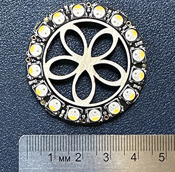
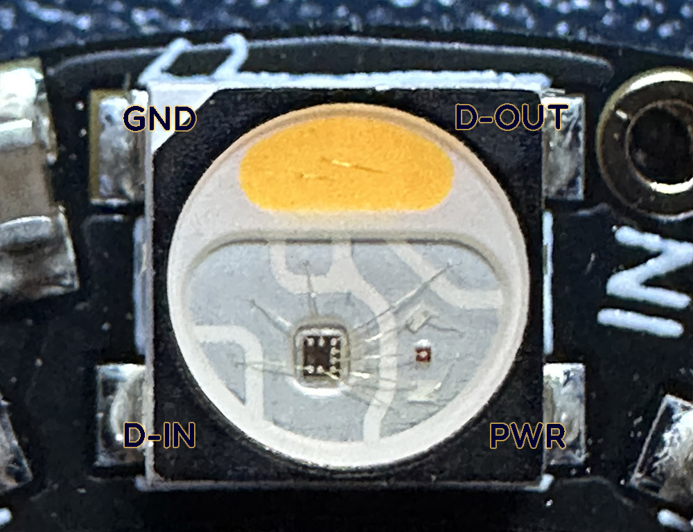
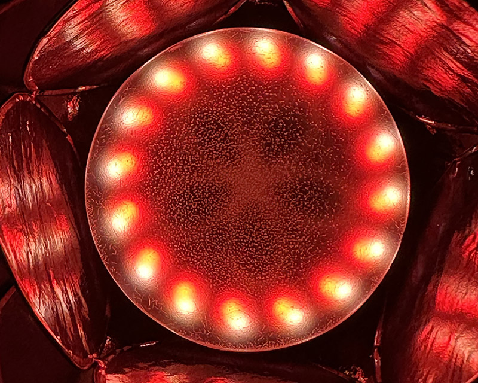
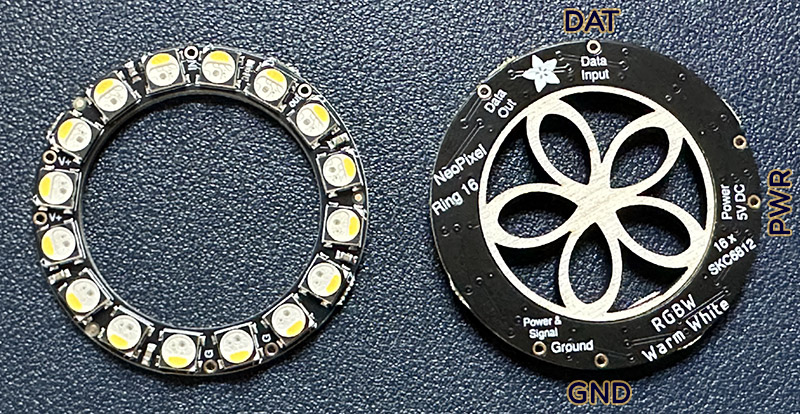
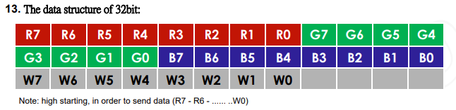
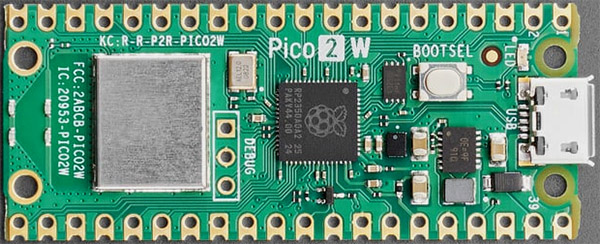

# LED Technical Details: Blossom Programmable Light Display

We're artists painting with light, and our instrument of choice for this project is called the "SK6812RGBW-WS" - it's a tiny 5mm x 5mm wafer of electronics with four integrated LEDs. These things are _bright_ and _colorful_. Best of all, you can string them together and address them individually, creating incredible patterns. We'll use a ring of 16 of these chips to create the Blossom.

In this guide, we'll look at these cool little LEDs, describe how they work, and then talk about how we send instructions to them with our microprocessor!

---

## Table of Contents

1. [Introducing the SK6812](#1-introducing-the-SK6812)
2. [Adafruit's "NeoPixel" Rings](#2-adafruits-neopixel-rings)
3. [Talking to LEDs](#3-talking-to-leds)
4. [Taking Advantage of the Pico](#4-taking-advantage-of-the-pico)
5. [Newer LED Tech](#5-newer-led-tech)
6. [LED Power and Brightness Considerations](#6-led-power-and-brightness-considerations)
7. [Further Reading](#7-further-reading)

---

## 1. Introducing the SK6812

Not long after humanity mastered the secrets of the elusive blue LED, the race was on to shrink and string together LEDs into everything from decorative lighting strips to bright LED monitors. In the early 2000s engineers invented a "5050" LED package, so-named because it was 5.0 mm x 5.0 mm in size. Whole strips of these tiny lights could be easily manufactured. A popular design is to put adhesive backing on long flexible strips of 5050s, allowing people to place a thin strip of brightly-colored lighting wherever they want. Designers could easily control the RGB values of the whole strip at once.

But programmers and artists wanted to be able to make _patterns_ with the lights! To do this, engineers needed to design "individually addressable" LEDs so that you can control the color and brightness of each individual light in the string. It seems impossible to control a whole string of lights with a single data out line from a microcontroller, but those mad lads did it! A generation of lights came out with names like WS2812B or SK6812, designed to be strung together yet individually programmed. Rather than make people memorize an alphabet soup of chip designations, Adafruit gave this technology a name: "NeoPixels." 

We are interested, specifically, in the "SK6812" lights, invented by Dongguang Opsco Optoelectronics in 2015. These guys are special because they have FOUR LED lights integrated into the package: red, green, blue, and a special white LED that comes in various color warmths. For this project, I like the warmest color available, "Warm Sunlight." At low intensities, this looks the most like an incandescent light or candle flame. The full chip name, "SK6812RGBW-WS" reflects this choice. Let's look at it!

What's this? There's a whole little logic circuit in there! Each of these lights have their own tiny controller embedded _right onto the chip_. It's not super sophisticated; all it does is either light up a specific color or pass the color information on to the next light. We'll talk about how that works in [part 3](#3-talking-to-leds).

You'll see four pads on the corners of the chip, the classic "5050" design for these things. I've labelled the pads for the SK6812: Power input (5V) and ground are on opposite corners. The other two corners are for "data in" and "data out." The idea is you can wire up a whole line of these pretty cleanly, having a shared 5V line on one side, the ground line on the other, and a data line snaking between each light. 

Speaking of lights, it's hard to see the individual LEDs when the package isn't lit up. The red, green, and blue LEDs are packed together on the right side of the image. Turn your attention to that big golden semicircular area at the top of the chip. That's the whole reason we chose this hardware! That yellow piece is a diffuser on top of a very bright pure-white LED. The yellow color is why the resulting light is a warm yellow shine instead of the bright blue-white we associate with colder LEDs.

From any distance, the white and color channels blend right together, especially if you've got a good diffuser over the light. But if you're up-close - such as when the device is sitting on your desk - the color LEDs and the white LED are visibly just a little offset from one another. In the case of the Blossom, this slight offset only adds to the visual. In the photo below, all sixteen chips are lit up with both red and white lights. Taken together, they make a kind of spiral pattern!

---

## 2. Adafruit's NeoPixel Rings

Individual LEDs are cool, but they're _tiny_. Without a heat-gun and an advanced workshop it's really hard to solder these. But the whole point of the 5050 form factor is to be able to easily manufacture these in strips or shapes or matrices. A quick search for "SK6812 LED" on [Alibaba](https://www.alibaba.com/) will reveal hundreds of such products. My favorite designs come from [Adafruit](https://www.adafruit.com/), a New York based company focused on cool tech for hobbyists like us.

Adafruit uses the "NeoPixel" name for WS2812B designs (these only have the color LEDs, or "RGB") and the SK6812 designs (these are the ones with a dedicated white channel, "RGBW"). As discussed above, we're looking for the warmest white channel we can find, which brings us to this beauty:

* [Adafruit NeoPixel Ring 16x RGBW Warm White](https://www.adafruit.com/product/2854)

Adafruit has assembled 16 lights in a circle. The positioning of the white channel on the chip gives us a wonderful "outer ring" of white lights. The PCB is cut to the smallest possible size and we're given 6 connections, three of which I've labelled above. The power, ground, and data lines are (by design) 90-degrees apart around the circle. There's also a data-out line, for stringing multiple rings or strips of NeoPixels together (Adafruit's website has [Plans for making light-up glasses](https://learn.adafruit.com/celebration-spectacles) by connecting two rings this way.)

The outer diameter of the 16-light ring is 44.5mm (1.75"). That's almost the exact dimensions of a tea-candle, which gives us a library of decorative hardware to choose from. And we can address the white lights and colored lights independently, playing one pattern on the colorful "inner ring" while playing another on the bright "outer ring." It's like getting two rings of lights in a single hardware package! 

---

## 3. Talking to LEDs

You don't have to understand how the lights work to program pretty colors, but the technology that makes these lights "individually addressable" is pretty cool, so let's talk it out!

### Transmitting Data in Binary

The data line is binary, meaning it can only be "on" or "off" (technically, the voltage on the wire is either high or low.) Our goal is to turn little on/off pulses into color information. There are a lot of ways to do this, but our hardware uses signal timing. That is, a short-duration high pulse represents a 0 and a long-duration high pulse represents a 1. These pulses are spaced out very precisely (1.25 microseconds each!).

### From Binary to Colors

To convert the 1s and 0s (bits) into color information, we need to assign a handful of bits to each LED. 8 bits is known as a byte, and it's a digital way of storing a number between 0 (00000000) and 255 (11111111). Our hardware assigns one byte for each color LED. For instance, let's look at the red LED:

| Binary (R G B) | Decimal | Hex | Result |
| :---: | :---: | :---: | :--- |
| 00000000 | 0 | 00 | Off |
| 01010000 | 80 | 50 | Dim red |
| 10010110 | 150 | 96 | Rich red |
| 11111111 | 255 | FF | Brightest red possible |

>[!TIP]
>Programmers use hexadecimal (a 16-digit number system, using A-F in addition to 0-9) as a shorthand way of referencing groups of bits. Each "digit" represents four bits, from 0 (0000) to F (1111). So, instead of saying "1111-1100," you can just say "FC."

Similarly, we can assign eight bits to the green LED. It's physically right next to the red one, so when the red one is going full blast (255), and the green one is going full blast (255), the result is bright yellow. We've also got a blue LED there, and - you guessed it - we give it eight bits of its own. If all three channels are equally bright, the resulting color looks white. (This is, in fact, how "white LEDs" actually work.)

We use a total of 24 bits to give three values for red, green, and blue. By mixing them, we can get all sorts of fun colors. You can see it gets a little cumbersome to type it out in binary every time:

| Binary | Decimal | Hex | Result |
| :---: | :---: | :---: | :--- |
| 00000000 00000000 00000000 | 0 0 0 | 000000 | Off |
| 01010000 00000000 00000000 | 80 0 0 | 500000 | Dim red |
| 11111111 00000000 00000000 | 255 0 0 | FF0000 | Bright Red |
| 00000000 11111111 00000000 | 0 255 0 | 00FF00 | Bright Green |
| 00000000 00000000 11111111 | 0 0 255 | 0000FF | Bright Blue |
| 11111111 11111111 00000000 | 255 255 0 | FFFF00 | Yellow |
| 11111111 11010111 00000000 | 255 215 0 | FFD700 | Gold |
| 11111111 10100101 00000000 | 255 165 0 | FFA500 | Orange |
| 10000000 00000000 10000000 | 128 0 128 | 800080 | Purple |
| 01101010 01011010 11001101 | 106 90 205 | 6A5ACD | Slate Blue |
| 01000000 11100000 11010000 | 64 224 208 | 40E0D0 | Turquoise |
| 00000000 11111111 11111111 | 0 255 255 | 00FFFF | Cyan / Aqua |
| 11111111 00000000 11111111 | 255 0 255 | FF00FF | Magenta / Fuchsia |
| 11111111 11111111 11111111 | 255 255 255 | FFFFFF | Brightest white possible |

Of course, these are SK6812 lights, so they also have a white LED. Eight bits are set aside for this LED, essentially controlling how bright our special "warm sunlight" LED shines. This gives us a total of 32 bits of data, which are sent in order through the data line. Here's a picture of the data layout from the [actual datasheet](https://cdn-shop.adafruit.com/product-files/2757/p2757_SK6812RGBW_REV01.pdf):

### Programming a Whole String of Lights

Each light on our string gets 32 bits of data to set its color. But how do we control a whole string of lights? That's where the little integrated circuits inside each light come into play. The chip is programmed to collect 32 bits of data into a buffer and then:

* If more data keeps coming, it makes room for the new data. It empties the buffer by sending the data to the next light in the chain via the "data out" line.

* If the data stops for a specific amount of time (80 microseconds), the current data in the buffer is considered the correct color info, and it "latches in." The light now displays that color.

One nice thing about these lights is that they don't require constant updates: Once they are displaying a color, the on-board circuitry continues to display that color at the correct brightness until the data line pipes in new color info. 

### 'Individually Addressable' Means Software Not Hardware

You may have noticed that even though we often describe these lights as "individually addressable," the hardware itself really isn't. You don't technically tell the sixth light in the string to turn purple - each light has no information about where it is on the string! _Every time an individual light is updated, we have to update the entire string._

However, this happens fast. In the case of the Blossom and its 16 RGBW lights, it takes 720 microseconds to send all the color data and then pause long enough to latch. That means we could update the Blossom over 1300 times _per second_ if we wanted to.

Outputting data to the lights and storing their status is easy to manage in software. Each color channel is only one byte, so we can easily save the state of every single light in an array - even for huge strings or matrices of lights. We can update an individual light in the array (hence, "individually addressable") and then tell our processor to output the change to the whole string of lights.

We really take advantage of this with the Blossom. The white lights are treated as a separate array of data and we can perform calculations or animations on just the white channel. That data is then assembled with the color data in the correct order and sent to the hardware whenever the lights are updated... at a _leisurely_ 60 frames a second, by the way. Nice and slow!

---

## 4. Taking Advantage of the Pico

Now you know the secret of controlling a whole chain of LEDs, and all it requires is micro-second precise timing! It's possible to do this with a microcontroller: You program it to set a pin to high, and then wait so many microseconds, and then flip it to low, and then wait, and then... Honestly, it's not a very good use of a CPU. We'd rather use that processing power to do something interesting, like calculate new colors or patterns.

The hardware we're using is a handsome little miracle-machine, though! The Raspberry Pi Pico 2W uses the RP2350 microcontroller. It's that little black chip right in the center of your board, with the Raspberry Pi logo on it. This microcontroller not only has two CPUs; it also has a bank of 12 "Programmable I/O" state machines, or "PIOs."

### Programmable I/O (PIO) State Machines

Think of these little state machines as teeny-tiny machine-language computers. They only understand a handful of commands and only have a couple of registers, but they run with precise timing independent of anything else the computer is doing. You just load a program into these things, set the frequency they're going to compute at, and then let 'em rip!

The PIO machines are designed to solve the exact problem of communicating with our time-sensitive LEDs. We set up one machine just to communicate to our string of lights. The CPU dumps a big pile of color data onto it - an update for the entire string of lights - and then the PIO dutifully chews through the data, typing out 1s and 0s with precise timing, until its buffer is empty. The CPU just has to drop off the data and then it moves on to other things while the PIO sends the message. 

Information on how we program the PIOs can be found in our [PIO State Machines](/docs/pio_state_machines.md) documentation, or inside the source code at `/src/led_controller.cpp`.

---

## 5. Newer LED Tech

In the years since the SK6812 (and similar chips) were invented, LED technology has continued to advance.

- **Faster Refresh Rate:** Even when we're not updating the colors on each LED, the LED has to manage its own brightness level by turning on and off super-fast. This is called "Pulse Width Modulation" or just PWM. The little integrated circuit inside our chip takes care of this modulation for us so we don't have to think about it, but we can _see_ it. The Blossom's NeoPixels refresh at 1.2KHz. You can see the refresh rate if you light up a bare Neopixel ring and move it around quickly - it'll look a little flickery. The effect is even more noticeable if you shoot video. More advanced LEDs, like the APA102 designs that Adafruit calls "Dotstars," refresh 20 times faster. This is faster than the human eye can see, even when moving around quickly, and even on video. If your display relies on "persistence of vision" effects, the NeoPixels we use for the Blossom would look pretty dated.

- **More Flexible Timing:** Another advantage of the APA102/DotStar generation of lights is that they have a dedicated clock line in addition to data. Because they're more flexible with timing, they're easier to drive straight from the CPU and more resistant to signal interruptions/delays.

- **Faster Data Rates:** Our SK6812 NeoPixel array is picky about its timing, but with only 16 lights to manage, we can update it pretty quickly. With really long strings of lights, we start to worry more about how long it takes to send data to the entire string, and how many times per second we can do it. Newer LEDs support much faster data rates, which is important (again) for persistence-of-vision displays.

- **16-Bit Color Depth:** NeoPixels use 8 bits for each color channel, giving us 256 "brightness levels" (including off.) Doubling it to 16 bits gives us a whopping 65,536 brightness levels! Per color! The HD108 LEDs that came out in 2019 have this color depth, in addition to the fast data rates. You can really see Blossom's lack of color depth at low levels of light. Turn the colors or white channels down very low and you'll find you can't get a "smooth" fade; there's several visible steps of brightness with no in-betweens.

- **Backup Data Lines:** If any one of the Blossom's LEDs give out, the remainder of the ring will also stop working, because the dead light will no longer pass on data. On really huge builds with lots of lights, this becomes a nightmare to maintain. Later LED designs incorporate backup data lines that allow the strip to bypass any bad lights.

- **Continued Miniaturization:** Eventually 5050 designs gave way to 2020 designs, which is the same idea but in a 2mm by 2mm package. Adafruit calls these the "DotStar Micro." You can really pack those together. My friend, they kept getting smaller: As of 2025 you can get individually addressable LEDs that measure 1.1mm square (!). As Alex Lorman notes on [this github SK6805-EC10 project](https://github.com/alorman/SK6805-EC10-Notes), "Buy extras... breathing on them the wrong way blows them away."

---

## 6. LED Power and Brightness Considerations

### Colorful Accent Light or Blinding Flashlight?

Despite the tiny package, these LEDs can be _bright_. Colorful NeoPixel arrays are bright enough to be admired at night from a football field away. We must consider that when we set one of these things on our desk. 

>[!Tip]
>Just to pick a random example, don't stick your face right into the Blossom and plug it in while there's a bug in your code that turns on every light full blast. It's like that scene where they open the Lost Ark. This tip is written in blood.

Because we want to create a soft ambient lighting display, we only need to run these LEDs at a fraction of their potential. Inside the `\src\led_controller.cpp` code you'll find a constant named `LED_BRIGHTNESS`. It's set to 0.2 - that's right - we're capping our lights at 20% brightness!

    // Master brightness scalar (0.0 – 1.0). Adjust to taste.
    static const float LED_BRIGHTNESS = 0.2f;

Believe it or not, I feel that 20% may be too bright for a desktop display. I did most of my testing at 10%, so that I could look directly even at the brightest lights. 

Of course, now that I've warned you but showed you the code, you know what to do... Go ahead and play with that constant. Please be careful not to hurt your eyes! Setting that number to .75 makes it so you can see the colors even outside in daylight, and with higher numbers you can use your Blossom to beam colorful lights onto the ceiling and light up a dark room. Go for it!

>[!Tip]
>Don't give your partner a migraine with bright pulsating lights. This tip? Also written in blood.

### Power Use with 16 LEDs

The beauty of LEDs is that they're the most efficient design we have for converting electricity into light. That said, once you have a giant array of lights blasting colors at face-melting brightness, you really have to consider the power draw.

Our SK6812 lights are designed to use a 5V power supply. (Other common LEDs are designed for 24V, which is what we use in cars.) 5V is exactly what our Micro USB is delivering through the cable to the device. This makes wiring super simple: we pull power from the VBUS, pin 40 on the upper corner of the Pico. This connects us right to the incoming 5V line.

As you might imagine, there's a risk in powering the lights and microcontroller from the same supply. If the lights suddenly required a lot of power (say, a bright flash) they might interrupt operation of the computer. For this project, however, we're not too worried:

* The Blossom has only 16 lights. It's a manageable draw, even at full brightness.

* We're only running at 20% brightness.

* The Pico is a super-star at power management and requires very little power on its own.

This gives us enough overhead that I didn't complicate the device with a separate power line. What happens if we wanted to light up a bigger project?

### Power Use for Longer Strings of LEDs

Little 5050-size LEDs are small, so the wires connecting them are also small. There's also a little bit of resistance in those copper traces, so if you have a long string of lights, voltage begins to drop over the distance. The lights at the end of the string, farthest from the power supply, won't get enough "juice" and they won't display the proper colors.

For our 5V hardware, this becomes a problem once we've got more than 40 or 50 lights. This is solved by something called "Power Injection," which is simply adding some extra 5V and ground lines that connect into the string every meter or so, spreading out the power draw.

---

## 7. Further Reading

Congratulations! You're now an expert in the incredible world of _individually addressable LEDs_. This tech is changing every few years. The best place to see the state-of-the-art lighting technology in action is, funny enough, at EDM festivals or raves. Artists today can create brightly illuminated, animated, programmable riots of light and color that were unimaginable even a decade ago. I hope the Blossom is just the first of many such projects for you!

* [Adafruit's Neopixel Überguide](https://learn.adafruit.com/adafruit-neopixel-uberguide) - Enormous how-to resource deserving of the umlaut.
* [Understanding the WS2812](https://cpldcpu.com/2014/01/14/light_ws2812-library-v2-0-part-i-understanding-the-ws2812/) - A very technical but foundational study of the communication protocol we talked about in part 3.
* [PicoTech's NeoPixel Blog](https://www.picotech.com/library/articles/blog/how-do-individually-addressable-leds-work) - See how NeoPixel signalling looks through an oscilloscope.
* [QuinLED](https://quinled.info/) - An extensive addressable LED resource, including guides, videos, and a Discord.
* [Blossom's PIO State Machine Guide](/docs/pio_state_machines.md) - A closer look at the PIO State Machines and how they're programmed, complete with code.
* [Official Raspberry Pi "PIO" Documentation](https://datasheets.raspberrypi.com/rp2350/rp2350-datasheet.pdf) - The primary source for programming PIO state machines. This is pretty advanced stuff.
* [Gary Explains the PIO State Machines](https://www.youtube.com/watch?v=QlKtEA5XKc4) - A friendly video explanation of the PIO documentation above.
* [Adafruit DotStar Guide](https://learn.adafruit.com/adafruit-dotstar-leds) - The successor to the NeoPixels we use.
* [Adafruit's LED Intro](https://learn.adafruit.com/all-about-leds) - A more basic introduction to LED technology and the many available form-factors.
* [Visit an LED Factory with SparkFun](https://learn.sparkfun.com/tutorials/how-leds-are-made) - See how LEDs are made. 
* [The SK6812RGBW Datasheet](https://cdn-shop.adafruit.com/product-files/2757/p2757_SK6812RGBW_REV01.pdf) - Full technical specs about the specific light this project uses.

### Other LED Communities and Forums

* [Reddit: r/WLED](https://www.reddit.com/r/WLED/) - Lots of practical advice for real-world builds. You'll see some amazing projects on here!
* [Reddit: r/LED](https://www.reddit.com/r/led/) - Reddit's general LED forum. Less technical, but often fun.
* [Reddit: r/FastLED](https://www.reddit.com/r/FastLED/) - Specializing in writing code to support LED designs.
* [The Adafruit Discord Server](https://adafru.it/discord) - A great community of makers. If you're stuck, you might find friendly help in real-time!
* **Your Local Makerspace!** - The most fun way to get help is to connect with other makers in your area. Today Blossoms... tomorrow Art Cars!
