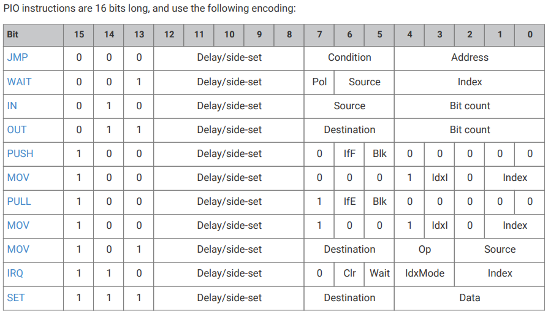
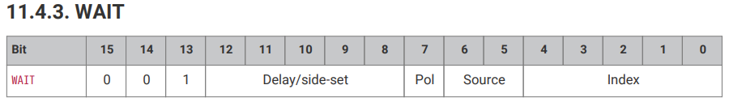

# PIO State Machines: Blossom Programmable Light Display

As described in the [LED Technical Details](/docs/led_technical_details.md#4-taking-advantage-of-the-pico), our Raspberry Pi Pico 2 has a bank of 12 "Programmable I/O" state machines, or "PIOs." Our hardware is built to control a lot of devices, some of which (like our LED lights!) may require specific signal timing. These little state machines are like tiny processors of their own that run independantly of the main CPUs. They're perfect for sending messages or instructions between different parts of the computer while our powerful processors are doing something else.

Our LED lights are controlled by a single data line that requires super-specific signal timing, sending a "1" or a "0" every 1.25 microseconds. Any interruption in our data stream might corrupt the data. Rather than use a CPU to babysit the signal, this is a textbook example of what the PIO state machines are made for! In the Blossom, one of our CPUs (core 1 in this case) calculates the next frame of animation data and drops all of the color information into the PIO's buffer. The CPU is free to move on to other tasks while the PIO dutifully converts the data into a perfectly-timed signal that it types out to the lights, 1.25 microsecronds for each and every 1 or 0, until the data is sent. 

For more details about how the lights work, see the [LED Technical Details](/docs/led_technical_details). In this section, we're going to look at the PIO and how we coded it. 

>[!TIP]
>Understanding the PIO state machines is an incredible exercise for a computer scientist! This is pure bits and steel. It's machine-code in action. Learning how PIO state machines work demonstrates how _computers_ work at the lowest level. Let's do it! 

---

## Table of Contents

1. [The Hardware](#1-the-hardware)
2. [PIO Machine Language](#2-pio-machine-language)
3. [Our LED Code](#3-our-led-code)
4. [Assembly](#4-assembly)
5. [Further Reading](#7-further-reading)

---

## 1. The Hardware

To understand what's happening inside the hardware, let's shrink ourselves down to computer-size! Imagine that you are in a small workshop. Looking around, here's what you see:
- A mailbox on the wall for incoming mail
- A mailbox on the wall for outgoing mail
- A simple clock with only one hand and only one number
- A big instruction book, with a bookmark reserved just for you
- A little shelf big enough to hold a number, labelled "Scratch X"
- An identical little shelf labelled "Scratch Y"
- One or more Big Important Switches on the back wall
- A Very Important bright red telephone labelled "IRQ."

Congratulations, you're a PIO! Your job is super-simple. The clock is spinning at a constant rate. Whenever it tells you to, you go to the instruction manual and read the instruction given at your bookmark. There are less than a dozen instructions total, and every instruction is SUPER simple, like:

- "Grab a number from your inbox and put it onto the Scratch X shelf."
- "Move your bookmark to a different page."
- "Copy the contents of Scratch Y to your Out-box."
- "Pick up the Red IRQ Phone and push 0!"

As a PIO, you're not even expected to do _math!_ For the most part, you pretty much just conditionally move data around.

**PIOs Operate Independant of the CPU**

From the perspective of the computer, every PIO workshop is self-operating. The CPU drops off the instruction book, sets the bookmark, sets the clock speed, and then leaves the PIO alone to run those instructions until someone tells it to stop or the computer blows up.

The giant red "IRQ" phone is an exception, used for communicating directly between the PIO and CPU. "IRQ" stands for "Interrupt Request" and the CPU can be programmed to drop whatever it's doing and handle that request immediately. This is expensive and potentially disruptive to the CPU, which is why I describe it as a red phone. The phone works both ways - the CPU can make the phone ring, and the PIO will respond _if its instructions call for it._ One example might be "wait here until the red phone rings," or "jump to this instruction if the red phone is ringing."

**PIOs Directly Operate the GPIO Pins**

What I described as "important switches on the back wall" are the GPIO ("General-Purpose Input/Output") pins of the Raspberry Pi Pico 2W. The Pico is a microcontroller, which means its job is to control stuff. In this case, we're controlling a string of LED lights from GP16 (pin 21 on the corner of the device - See the [Wiring Guide](/docs/assembly.md#6-wiring-the-pico-2w)). Our PIO will flip this switch "on" and "off" to send color data out to the LEDs. In our setup, _only_ the PIO has access to this pin. If we want the lights to do something, they talk to the PIO!

Our "LED Controller" program is very simple and only uses one pin: It'll read data one bit at a time from the inbox, then toggle the LED data pin on and off with perfect timing. It's a super-simple job, and our little machine will do it non-stop. 32 bits of data per light, times 16 lights, 60 times a second... That's 30,720 bits of data processed every _second_. Go little machine, go!

---

# 2. PIO Machine Language

Let's take a close look at what I described as a big "instruction book" with a personal bookmark. As with everything else in a computer, the instructions are saved as a bunch of ones and zeroes, stored in memory. What I desribed as a "bookmark" is called the "Program Counter," and it's really just a pointer to the memory address of the instruction you're on.

Think _small_. The entirety of the instruction book is only 64 bytes. That's 512 bits. This paragraph of text is more than twice that size!

Every complete instruction for the PIO is represented in only 16 bits. Below you'll find a table of all the possibilities, and how the 16 bits are used. As you can see, every single 1 or 0 makes a difference! There's a whole 5-bit section (called "Delay / Side-set") that we can customize to squeeze even more operations out of every bit:

Don't sweat all the details yet - learning all of these instructions and how they work would make you a true machine language programmer! The really important thing to understand right now is _how_ it works: The PIO uses just a few ones and zeroes to perform any action. Let's just look at one example!

Your PIO starts reading an instruction and sees that the first three bits are "001." That means "Wait," so the remainder of the bits are going to tell the PIO how long to wait and what to wait on. The next five bits are customizable when we set up the machine, we'll talk about them in a second. The next bit (labelled 7) stands for the "polarity" - in other words, are we waiting for a 1? Or are we waiting for a 0? Bits 5 and 6 together tell us the "source" we're waiting on. For instance, if these two bits are "00" that means we're waiting on one of the GPIO pins, and the next five bits (labelled 0-4) will tell us which one. If bits 5 and 6 are "10" that means we're waiting on an IRQ (checking the status of the "Red Phone" to the CPU...)

## Customizing Your Instructions: Delays and Side-Sets

When we first set up a PIO state machine, in addition to writing the instruction book and setting the clock speed, we can also tell the machine how to interpret those five "Delay / Side-Set" bits.

By default, all five bits are used to calculate a delay - that is, a period of cycles we wait after completing this instruction before we move to the next one. Five bits can hold a number between 0 and 31 - in other words, if all the bits are 0s, we don't delay at all, and execute the next instruction on the next clock cycle. If all five bits are 1s, then we delay 31 cycles before advancing.

>[!Tip]
>Since we can set the clock timing to whatever we want (up to the clock speed of the CPU), we can precisely time our delays. Even without overclocking the Pico 2W we can set the clock cycles to be as fast as 6.7 _nanoseconds_ per tick. These machines are built to be fast and precise!

But if we don't need a full 31-cycle delay anywhere in our program, we can sacrifice some of those "delay" bits to "side-set" a pin. The engineers who designed the system thought about it this way: One of the most important things a PIO will do is toggle a GPIO pin on or off. Rather than waste a full instruction every time we want to do that, we assign some of those bits to setting a pin on or off in addition to whatever the main instruction is. Hence the name, "side-set."

By establishing a side-set pin when you initialize a state machine, you can write your instructions along the lines of, "JUMP here (and also turn the pin on)", "MOVE this (and turn the pin off)." Our state machine only has the memory for 32 instructions, so by packing the instructions in like that you really maximize the effectiveness of every bit.

## Now You're Speaking Machine!

Obviously it would take a long time to explain every bit of every instruction, but if you understand the concept, you have just learned how computers work at a fundamental level. Your state-of-the-art desktop CPU uses more than 16 bits per instruction, and it has a great many more operations it can do and scratch registers to do them on. It's got more bits set aside in its instructions for things like long memory addresses. But _it fundamentally works the same way as a PIO state machine_, converting _bits_ into _instructions_ and doing them every clock cycle.

If you understand what's happening down there in binary, you understand how computers operate at the lowest level. Congratulations! In this day and age of vibe-coding, very few humans actually comprehend what's going on at this machine level, and fewer still know how to program there.

>[!Note]
>That's why I wanted to make sure PIO-coding was a part of this project. These little machines are a perfect demonstration of machine code in action, and you can play around in this space on a computer that costs less than a cheeseburger meal.

---

# 3. Our LED Code

    @rp2.asm_pio(sideset_init=rp2.PIO.OUT_LOW, out_shiftdir=rp2.PIO.SHIFT_LEFT, autopull=True, pull_thresh=32)
    def neopixel_projector():
        """
        Waits for a stream of colors from the main program and sends them to the
        NeoPixel with precise timing. WS2812B timing constants: Each "pulse" is
        0.125 microseconds (us). Total signal is 10 pulses / 1.25 us.
        Run this machine at 8MHz (freq=8000000) for microsecond-perfect timing!
        """
    
    # To send a "1", we need a high pulse of 7 cycles (T1 + T2) and a low pulse of 3 cycles (T3).
    # To send a "0", we need a high pulse of 2 cycles (T1) and a low pulse of 8 cycles (T2 + T3).
    # Cycle Delays: T1 = 2; T2 = 5; T3 = 3 Combine timings for 10 cycles per bit.
    wrap_target()
    label("bitloop")
    out(x, 1)               .side(0) [T3 - 1]
    jmp(not_x, "do_zero")   .side(1) [T1 - 1]
    label("do_one")
    jmp("bitloop")          .side(1) [T2 - 1]
    label("do_zero")
    nop()                   .side(0) [T2 - 1]
    wrap()

